# Lineage 2M Discord Text Boss Notifier En
[Русская версия - Lineage 2M Discord Text Boss Notifier Ru](https://github.com/DarkDesire/lineage2m-discord-text-notifier-bot-ru)
 Bot update date: 2023-04-13
 
 
Lineage 2M text bot, notifies about bosses respawns in Discord
  ! There also exists a voice version of the the bot !
  * No hardware requirements. It is enough python on the server.

## How to install?
At the very end of the guide ...

## Available bot functional:
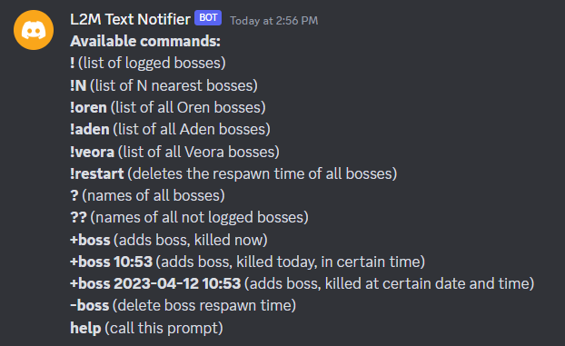

## Automatically. Every 5 minutes reminds about the nearest bosses
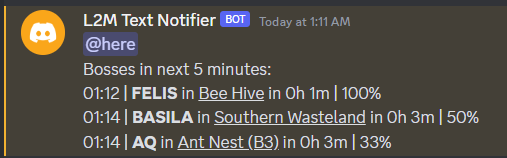
 Automatically prolongs the boss's resp
 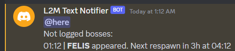

### **<> Command !**
If there are no bosses, it shows a notice
 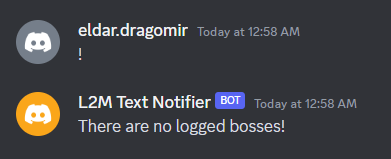
 If there are logged bosses, it shows them in respawn order
 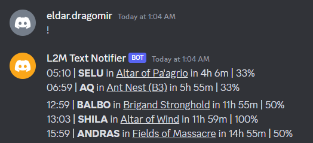

### **<> Command !N**
Shows the nearest N logged bosses
 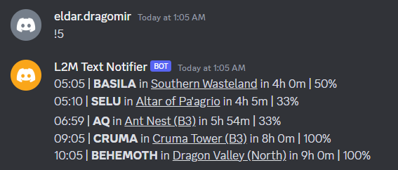

### **<> Command !veora**
Shows the all Veora bosses
 There are also for Oren, Giran, Aden
 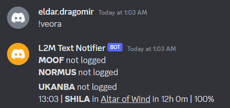

### **<> Command !restart**
Clear __all__ logged bosses. Usefull after restart.
 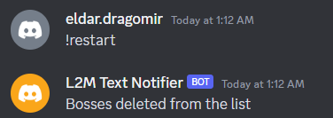

### **<> Command ?**
Shows the names of  __all__ bosses.
 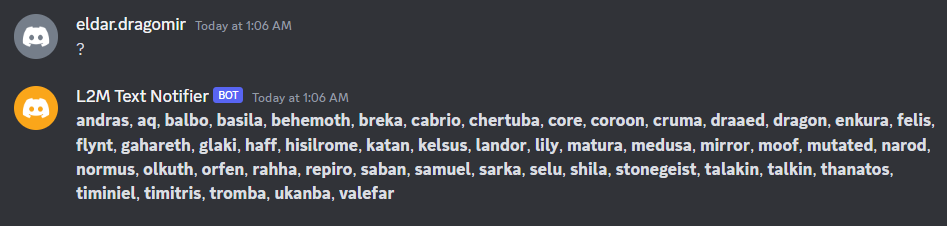

### **<> Command ??**
Shows the names of __all__ not logged bosses.
 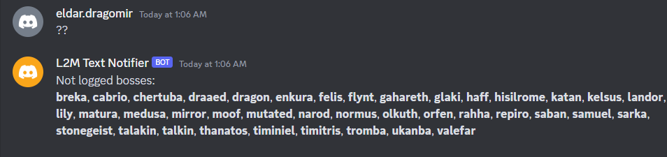

### **<> Command +boss**
You can add in various ways. It is not necessary to specify the whole name of the boss correctly.
 You can specify the time in the past, if known, using the full-day format.
 You can specify the time of killing in hour format only.
 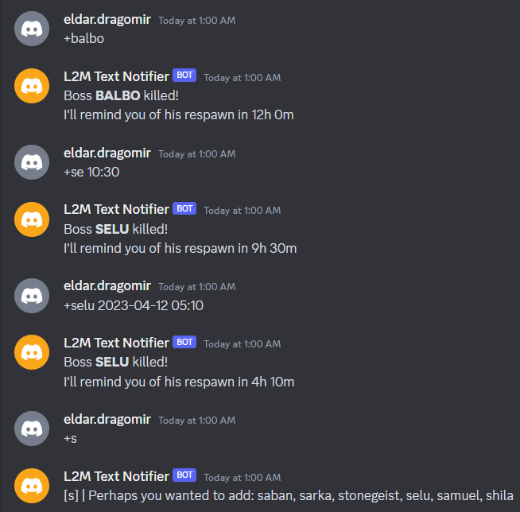

### **<> Command -boss**
Deletes one boss from the respawn list
 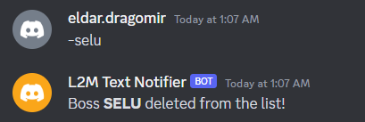

### **<> Command help**
 Always appears when an unsuccessful command is entered or when this command is invoked
 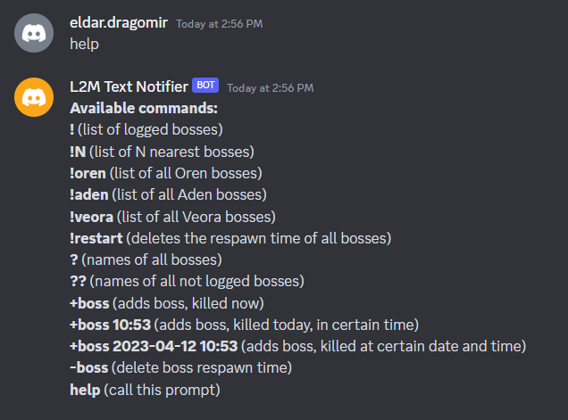

## How to install?
**! All the code is in this repository !**
> You only need to know Python and see the documentation on the bot from Discord to do everything yourself.

**If you do not want to install manually, I will help you run on your server for _donation_ (50€)**
 _I have scripts both to run on weak servers and to run in a container in Docker on good servers._

## My contacts:
- [Instagram](https://www.instagram.com/eldar.dragomir/)
- [Telegram](https://t.me/eldar_dragomir)